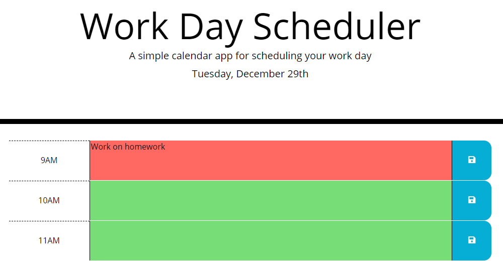

# work-day-scheduler

## Description
A simple one-day calendar for tracking events for each hour of the work day. Each row's color is determined by whether it is the past, present, or future. Text can be entered for each hour, which can then be saved to local storage with the "save" button. This data will then be loaded when returning to the page.

This is a single-page application that makes use of Bootstrap, jQuery and moment.js.

## Screenshot

## Deployment
This website has been deployed on GitHub as http://malenchite.github.io/work-day-scheduler

## Credits
Bootstrap courtesy of https://getbootstrap.com  
jQuery courtesy of https://jquery.com  
moment.js courtesy of https://momentjs.com  

Basic HTML and CSS design provided as part of an assignment for UNC Coding Bootcamp